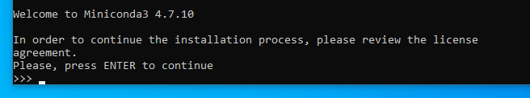
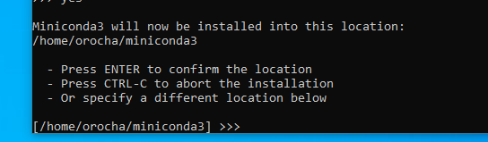
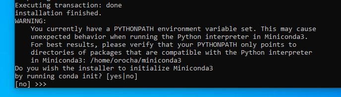
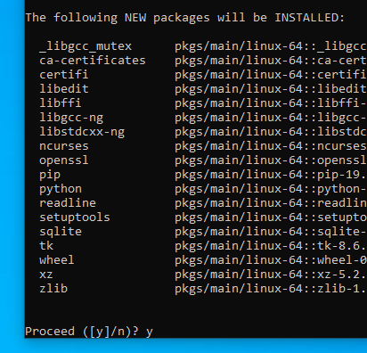
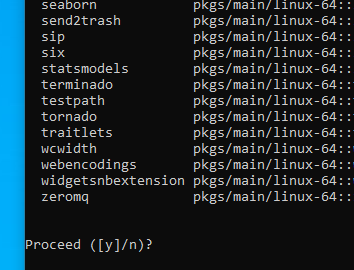
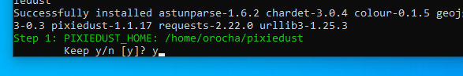
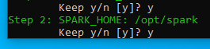
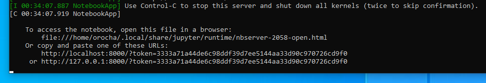

# Install Apache Spark on Windows Subsystem for Linux
This tutorial summarizes the steps to install Apache Spark on Windows 10 via Windows Subsystem for Linux (WSL).
The goal is to create on your personal computer an environment for developing and testing routines for processing large-scale data using Spark. 
Jupyter and two Spark kernels are used to provide an enviromnent similar to the [Databricks](https://databricks.com/), however, without the distributed computing capabilities presented in cloud systems like Microsoft Azure, AWS, etc...


# Prerequisites
1. Enable WSL on Windows 10
2. Install required packages:
   1. Java SDK
   2. Scala
   3. Apache Spark with Hadoop 2.7
   4. Miniconda
   5. Jupyter, Spark and PySpark kernels


## Enabling and configuring WSL

There are several detailed tutorials on the web that explain how to enable and configure the Windows Subsystem for Linux. 
I recommend to follow the instructions presented by [microsoft](https://docs.microsoft.com/en-us/windows/wsl/install-win10) or by [ubuntu](https://wiki.ubuntu.com/WSL).
However, if you prefer instructions presented with GIFs, check the tutorial made by [cainwatson](https://dev.to/operationspark/windows-wsl-setup-with-gifs-33aj).

Or just do: 

##### Enable WSL

* Go to **Start** &rarr; **Control Panel** &rarr; Visit **Programs and Features** &rarr; **Turn Windows features on or off** &rarr; Check **Windows Subsystem for Linux** &rarr; Click **OK** and **Restart** computer.

##### Install Ubuntu
* Open **Microsoft Store** &rarr; Search for **Ubuntu 18.04 LTS** &rarr; Select **Get** to install the Ubuntu terminal on Windows &rarr; Go to **Start menu** &rarr; Select **Ubuntu 18.04 LTS** and wait a moment &rarr; Create a username and password. 


# Configure Spark environment automatically 

1. Open Ubuntu terminal.
2. Execute the following commands in terminal:
     
     - `wget https://github.com/ornrocha/data-science-tools-with-WSL/raw/master/Spark-install/scripts/install_spark_env_wsl.sh`
     - `chmod +x install_spark_env_wsl.sh`
     - `./install_spark_env_wsl.sh`


3. Follow the instructions that will be asked.
    
    1. After installing Java, Scala and Apache Spark, miniconda it will be configured. Press **ENTER** read license of miniconda.

    

    2. Write **yes** and Press **ENTER** to accept license of miniconda.

    

    3. Press **ENTER** to accept the default loaction of miniconda or specify a different location [Note: orocha is my home, it will be shown your username].

    

    4. Press **ENTER** to accept the default [no] option.

    

    5. Choose [**y**] and press **ENTER** to create your conda environment.

    

    6. Choose [*y*] and press **ENTER** to install the remaining packages.

    

    7. The required [kernel PixieDust](https://pixiedust.github.io/pixiedust/index.html) it will be installed in the next step, choose *n* to change the default location or *y* otherwise.  

    

    8. Choose *y* and and press **ENTER**

    

    9. Choose *y* and and press **ENTER**

    

    10. Choose *n* if you want to change the kernel name [optional].
        
    

    11. Give the kernel a name if you chose to rename it (previous step).
        
    

4. During the automatic installation of the Spark environment, a script **init_jupyter_spark.sh** to initialize jupyter is created. You can edit this script by running the following command:

    - `nano init_jupyter_spark.sh`
    
    * After editing the script, if necessary, press **CTRL-O** to save your changes and/or **CTRL-X** to exit.

5. Execute this script to initialize your jupyter notebook with the Spark environments.

   run the command: `./init_jupyter_spark.sh`

   

5. Copy one of the jupyter urls and paste on your browser. 

   


# Configure Spark environment step by step


### 1. Open Ubuntu terminal.
* Go to **Start** &rarr; launch **Ubuntu 18.04 LTS** .

### 2. Download and install OpenJDK 8

* Install OpenJDK 8 by executing the following commands:

    - `sudo apt update`
    - `sudo apt install openjdk-8-jdk-headless`

* Once installed, execute the following command:

    - `echo 'export JAVA_HOME="/usr/lib/jvm/java-8-openjdk-amd64"' >> $HOME/.bashrc`


* Export JAVA_HOME environment variable in the current terminal (required to install miniconda)

    - `export JAVA_HOME="/usr/lib/jvm/java-8-openjdk-amd64"`


### 3. Make a directory to save distros temporarily
     
* download and install (extract) Spark:

    - `mkdir sources`
    - `cd sources`


### 4. Download and install [Scala](https://www.scala-lang.org/)

* Download, extract and install Scala:

    - `wget https://downloads.lightbend.com/scala/2.11.12/scala-2.11.12.tgz`
    - `tar -xvzf scala-2.11.12.tgz`
    - `sudo mv scala-2.11.12 /opt/scala`
    - `echo 'export SCALA_HOME="/opt/scala"' >> $HOME/.bashrc`

* Export SCALA_HOME environment variable in the current terminal (required to install miniconda)

    - `export SCALA_HOME="/opt/scala"`


### 5. Download and install [Apache Spark](https://spark.apache.org/) with [Hadoop](https://hadoop.apache.org/)

* Execute the following commands to download, extract and install Spark:

    - `wget https://archive.apache.org/dist/spark/spark-2.4.3/spark-2.4.3-bin-hadoop2.7.tgz`
    - `tar -xvzf spark-2.4.3-bin-hadoop2.7.tgz`
    - `sudo mv spark-2.4.3-bin-hadoop2.7 /opt/spark`
    - `echo 'export SPARK_HOME="/opt/spark"' >> $HOME/.bashrc`

* Export SPARK_HOME environment variable in the current terminal (required to install miniconda)

    - `export SPARK_HOME="/opt/spark"`


### 6. Download and install [Miniconda3](https://docs.conda.io/en/latest/miniconda.html)
* Execute the following commands to download and install miniconda3:
    
    - `wget https://repo.continuum.io/miniconda/Miniconda3-latest-Linux-x86_64.sh`
    - `chmod +x Miniconda3-latest-Linux-x86_64.sh`
    - `bash Miniconda3-latest-Linux-x86_64.sh`
    
* Follow the instructions presented during miniconda installation.

* Join miniconda *bin* folder to *PATH* of linux

    - `cd $HOME`
    - `echo 'export PATH="$PATH:$HOME/miniconda3/bin"' >> $HOME/.bashrc`

* Create your conda environment

    - `CONDAENVNAME="name of your miniconda environment"`
    - `PYTHONVERSION="3.6"`

    - `$HOME/miniconda3/bin/conda create -n $CONDAENVNAME python=$PYTHONVERSION`
    - `source $HOME/miniconda3/bin/activate $CONDAENVNAME`
    - `conda install jupyter seaborn pandas` 
    
### 7. Configure Apache Spark kernels

* Install Apache Spark kernels

    - `pip install pixiedust`
    - `jupyter pixiedust install`
    - `pip install toree`
    - `jupyter toree install --spark_home /opt/spark --kernel_name="Toree" --interpreters=Scala,SQL --user`     


* Configure environment variables in *.bashrc*.

    - `echo 'export PYSPARK_PYTHON="'$HOME'/miniconda3/envs/'$CONDAENVNAME'/bin/python'$PYTHONVERSION'"' >> $HOME/.bashrc`
    - `echo 'export PYLIB="$SPARK_HOME:/python/lib"' >> $HOME/.bashrc`
    - `echo 'export PYSPARK_DRIVER_PYTHON="'$HOME'/miniconda3/envs/'$CONDAENVNAME'/bin/jupyter"' >> $HOME/.bashrc`
    - `echo 'export PYSPARK_DRIVER_PYTHON_OPTS="notebook --NotebookApp.open_browser=False"' >> $HOME/.bashrc`
    - `cd $SPARK_HOME/python/lib`
    - `PYJ="$(echo py4j*)"` 
    - `echo 'export PYTHONPATH="$SPARK_HOME/python/lib/'$PYJ':$SPARK_HOME/python/lib/pyspark.zip:$PYTHONPATH"' >> $HOME/.bashrc`
    - `echo 'export PATH="$PATH:$JAVA_HOME/bin:$SPARK_HOME/bin:$SPARK_HOME/sbin:$HOME/miniconda3/bin:$SCALA_HOME/bin:$SPARK_HOME/bin"' >> $HOME/.bashrc`


### 8. Make a shell script to initialize jupyter with Apache Spark environment

* To create a shell script execute the following commands:

    - `cd $HOME`
    - `touch init_jupyter_spark.sh`
    - `mkdir /mnt/c/jupyter_notebooks`
 
    - ```
      cat <<< "source $HOME/miniconda3/bin/activate $CONDAENVNAME
      jupyter notebook --no-browser --ip='localhost' --notebook-dir='/mnt/c/jupyter_notebooks' --port=8000" > init_jupyter_spark.sh
     
      ```

    - `chmod +x $HOME/init_jupyter_spark.sh`

## Initialize jupyter with Apache Spark environment 

1. Open Ubuntu terminal.
2. Execute the following script to initialize your jupyter notebook with the Spark environments.

   run command: `./init_jupyter_spark.sh`

   

3. Copy one of the jupyter urls and paste on your browser. 

    

